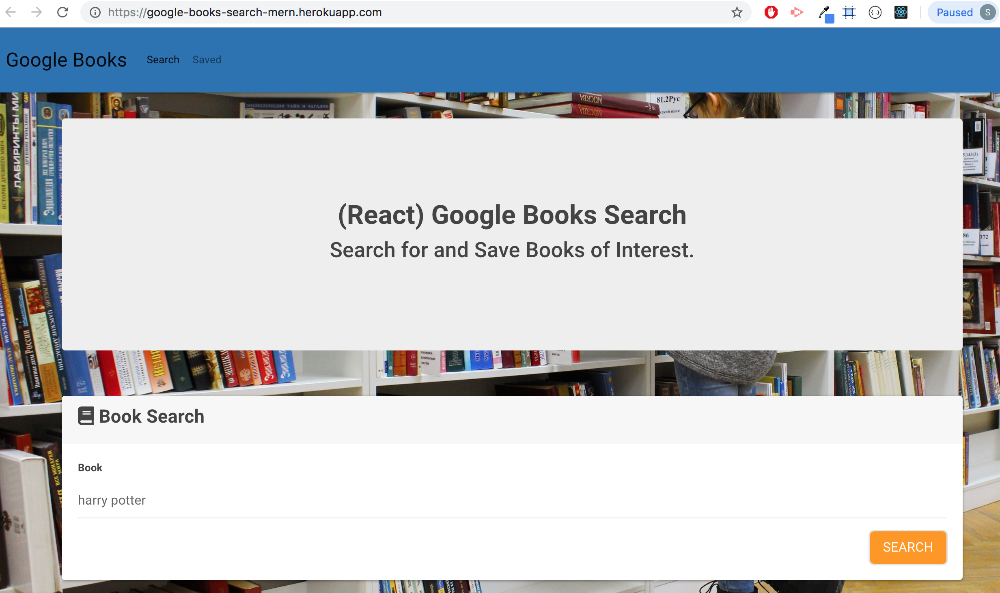
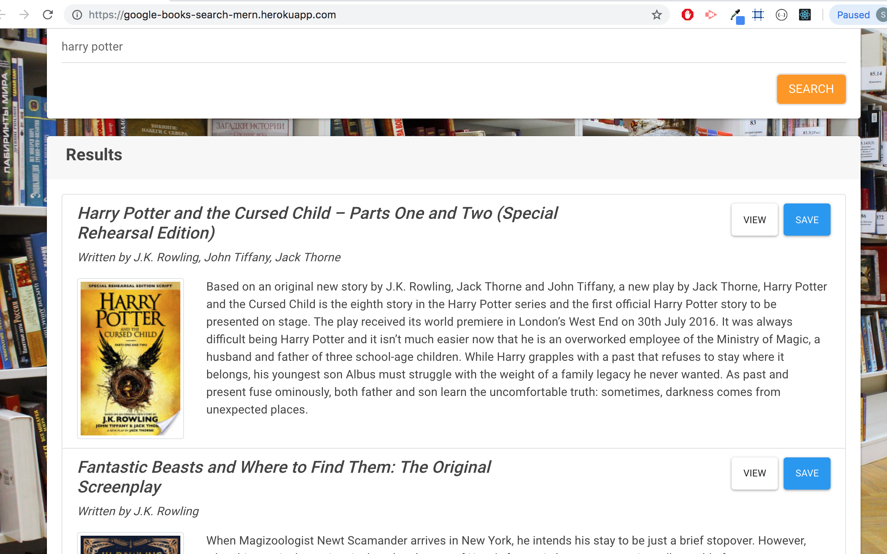
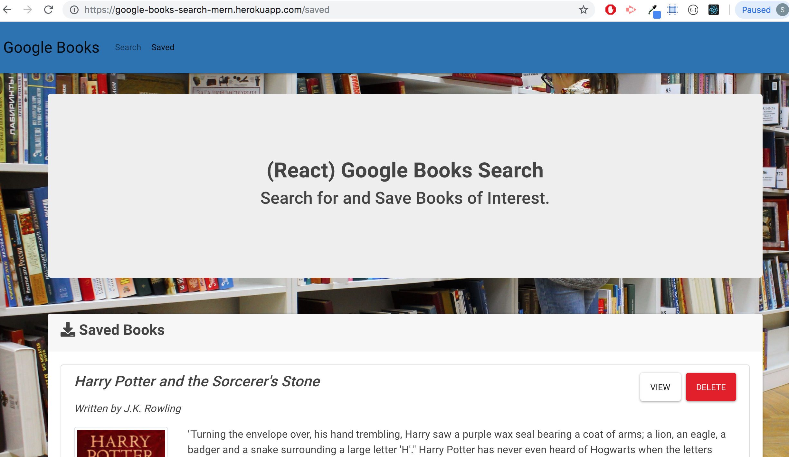
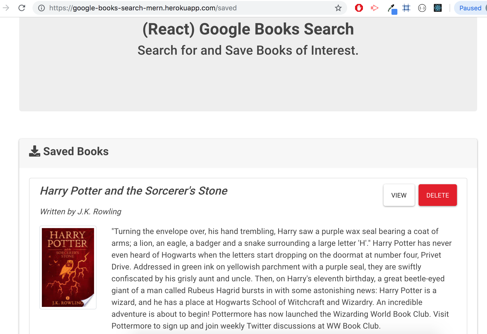

# :earth_asia: Google-Books-Search-mern


### Overview
---
React-based Google Books Search app.React components, work with helper/util functions, and utilize React lifecycle methods to query and display books based on user searches. This app uses Node, Express and MongoDB so that users can save books to review or purchase later.

### Getting Started
---
* Clone down repo ``` git clone git@github.com:liaswapna/Google-Books-Search-mern.git```.
* Navigate to the repo ```cd Google-Books-Search-mern.git```.
* Run command ```npm install``` in Terminal or GitBash
* Run command ```npm start``` to start ther server.

### Technologies Used
---
* React
* Materialize CSS
* Express
* MongoDB
* NodeJS

### Dependencies
---
Client side
```js
{
"react": "^16.8.4",
"react-dom": "^16.8.4",
"react-materialize": "^2.6.0",
"react-scripts": "^2.1.8"
}
```
Server side
```js
{
"axios": "^0.18.0",
"express": "^4.16.3",
"if-env": "^1.0.4",
"mongoose": "^5.3.16"
}
```

### Demos
---
* Search Book
* [Heroku Link]( https://google-books-search-mern.herokuapp.com/)

### Screenshots
---
#### Deployed App View

*   Search Page

    


    


*   Saved Page

    


    


